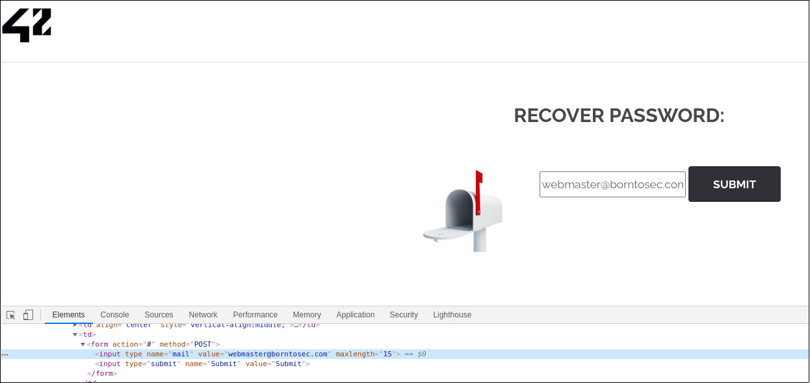

# Exploit

Upon landing on the password recovery page, the only thing we can do is click on a submit button.

If we take a look at the HTML, we notice a hidden input with the webmaster's email:

It will be sent to the backend via a POST HTTP transaction when the button is clicked.  
This means that we can change the email to gain control over the password recovery process.  
As there is usually very little or no control in hidden inputs, we could also in theory try inject code to retrieve the database's content.

# Mitigating the risk

The admin email should be in the href attribute of a `<a>` tag.
If an input is needed (for the user's email for instance), it should be thoroughly checked before taking any action.
