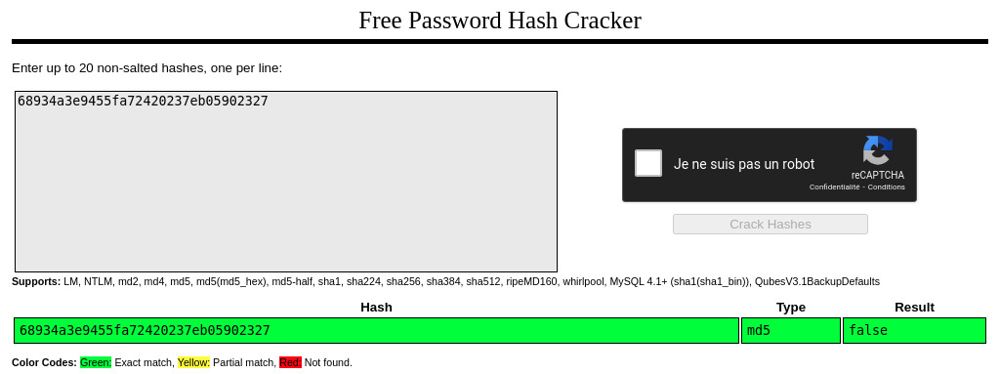

# Exploit

We see that there is a cookie named "I_am_admin".  
If we run its value through a hash cracker, we see that it's "false" hashed with an md5 algorithm:



Perhaps we can pretend that we are admin.
Let's hash the string "true":

```
[darkly@darkly] ~ # echo -n "true" | md5sum
b326b5062b2f0e69046810717534cb09  -
```

Then, if we replace the cookie value in the browser with this one, we get the flag.

# Mitigating the risk

First, this use of a cookie to store a boolean that indicates if the user has admin priviledges, is flawed:  
it is much too easy to understand which value will give us access.  
Instead, a token should be generated server-side upon successful admin authentication, and stored as a cookie in the browser.  
The check whether this token is associated with admin priviledges is then done server-side whenever the client makes a request.  
Even if the token value is visible, you can't predict another value that would be accepted as a valid token, let alone one with privileges.

Some additional precautions would be welcome:

- Set the httpOnly attribute, so that the cookie is sent with HTTP requests but is not available to client-side scripts.  
  This mitigates the risk of stealing the cookie via XSS.
- Ensure that requests' data be encrypted by using the HTTPS protocol and setting the attribute secure.
- Tie the session cookie to the IP adress of the user who authenticated, to only permit that IP to use the cookie.

To explore further:

- [cookies](https://developer.mozilla.org/fr/docs/Web/HTTP/Cookies)
- [session management](https://dzone.com/articles/broken-authentication-and-session-management-part)
- [OWASP tests for session management](https://owasp.org/www-project-web-security-testing-guide/latest/4-Web_Application_Security_Testing/06-Session_Management_Testing/01-Testing_for_Session_Management_Schema)
