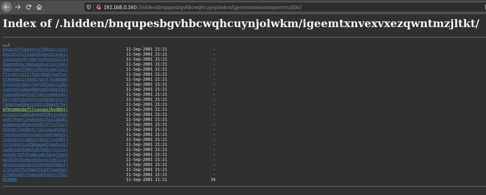

# Exploit

In a previous exploit, we noticed a .hidden directory.  
Inside, there's endless levels of directories with READMEs containing troll messages.



We'd like to check if there's a README with useful information, so we'll script a directory traversal
It should query the URIs recursively, scan their READMEs and output their content while filtering out identified troll content.

Run this script:

```
[darkly@darkly] ~/04-hidden_directory_traversal/Ressources # ./scripthidden.py
look into http://192.168.0.160/.hidden/
look into http://192.168.0.160/.hidden/amcbevgondgcrloowluziypjdh/
look into http://192.168.0.160/.hidden/amcbevgondgcrloowluziypjdh/acbnunauucfplzmaglkvqgswwn/
look into http://192.168.0.160/.hidden/amcbevgondgcrloowluziypjdh/acbnunauucfplzmaglkvqgswwn/ayuprpftypqspruffmkuucjccv/
look into http://192.168.0.160/.hidden/amcbevgondgcrloowluziypjdh/acbnunauucfplzmaglkvqgswwn/becskiwlclcuqxshqmxhicouoj/
(...)
```

```
[darkly@darkly] ~/04-hidden_directory_traversal/Ressources # cat outputhidden.txt
99dde1d35d1fdd283924d84e6d9f1d820
```

# Mitigating the risk

Don't put sensitive information within the web server's URI space.  
Never trust that a directory is fully hidden or unreachable !
