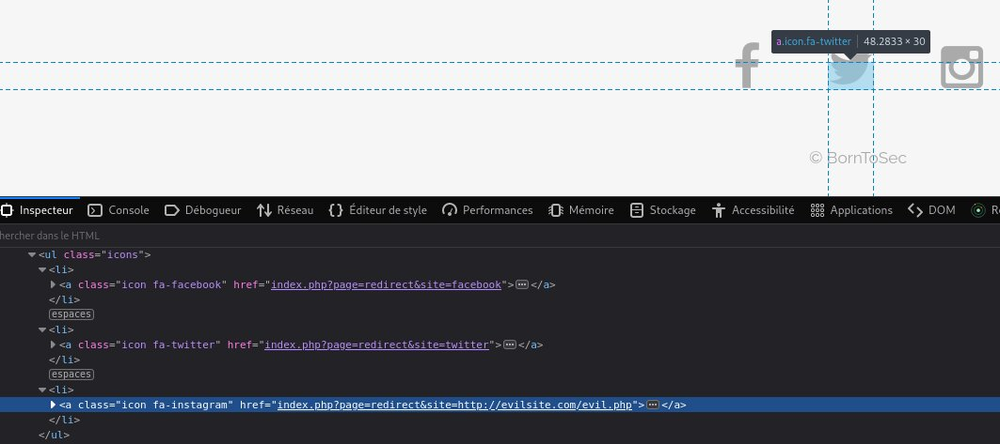

# Exploit

If we look at social networks icons code, we see that they query the backend by providing parameters, before redirecting to the appropriate site.  
We notice the absence of sanitization - this means that we could redirect to another evil website, or possibly make an SQL injection.

Unvalidated redirects are explained in the [OWASP documentation](https://cheatsheetseries.owasp.org/cheatsheets/Unvalidated_Redirects_and_Forwards_Cheat_Sheet.html)

# Mitigating the risk

The parameters should be checked server-side; if they do not match anything in the database, there should be no redirection.
Even better: the link should be specified server side !
