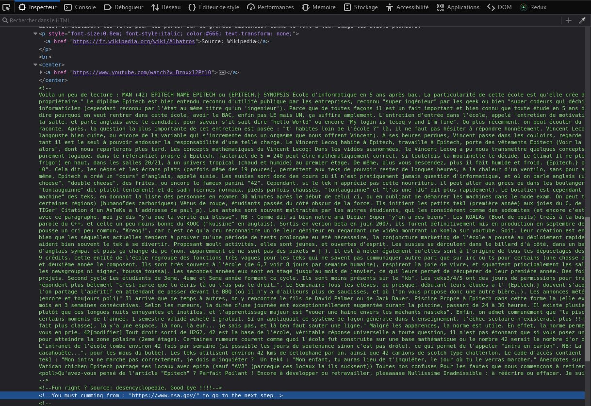

# Exploit

If we go to the copyrights page, we can look at the code and notice a very long comment with one useful information:



Additionally , we see we would pretend to be a specific kind of browser (through the User-Agent header):


In order to change the site from where a request is made, we should change the referer in the request headers.

```
[darkly@darkly] ~ # curl -H "User-Agent: ft_bornToSec" --referer https://www.nsa.gov/  http://192.168.0.160/?page=e43ad1fdc54babe674da7c7b8f0127bde61de3fbe01def7d00f151c2fcca6d1c | grep flag
  % Total    % Received % Xferd  Average Speed   Time    Time     Time  Current
                                 Dload  Upload   Total   Spent    Left  Speed
  0     0    0     0    0     0      0      0 --:--:-- --:--:-- --:--:--     0<center><h2 style="margin-top:50px;"> The flag is : f2a29020ef3132e01dd61df97fd33ec8d7fcd1388cc9601e7db691d17d4d6188</h2><br/></center> <audio id="best_music_ever" src="audio/music.mp3"preload="true" loop="loop" autoplay="autoplay">
100 24476    0 24476    0     0  5975k      0 --:--:-- --:--:-- --:--:-- 5975k
```

# Mitigating the risk

The main security concern is leaking information to other sites, such as exposed [here](https://developer.mozilla.org/en-US/docs/Web/Security/Referer_header:_privacy_and_security_concerns).  
This can occur if an element redirects to another website, that could capture information that appears in the URL (sent as referer)

Another possibility is to fake coming from a specific site or page to trigger specific behavior, such as when practicing referer spoofing as discussed [here](https://en.wikipedia.org/wiki/Referer_spoofing) and [here](https://www.brokenbrowser.com/referer-spoofing-defeating-xss-filter/)

All these are explained more fully [here](https://web.dev/referrer-best-practices/).

One should therefore consider the following:

- Setting referrer policies, such as `strict-origin-when-cross-origin`, to prevent sensitive information from being passed on to other websites
- Not disabling the XSS Filter if the request comes from a trusted domain
- Not conditioning disclosure of sensitive information with specific referers, much less any that could be guessed
