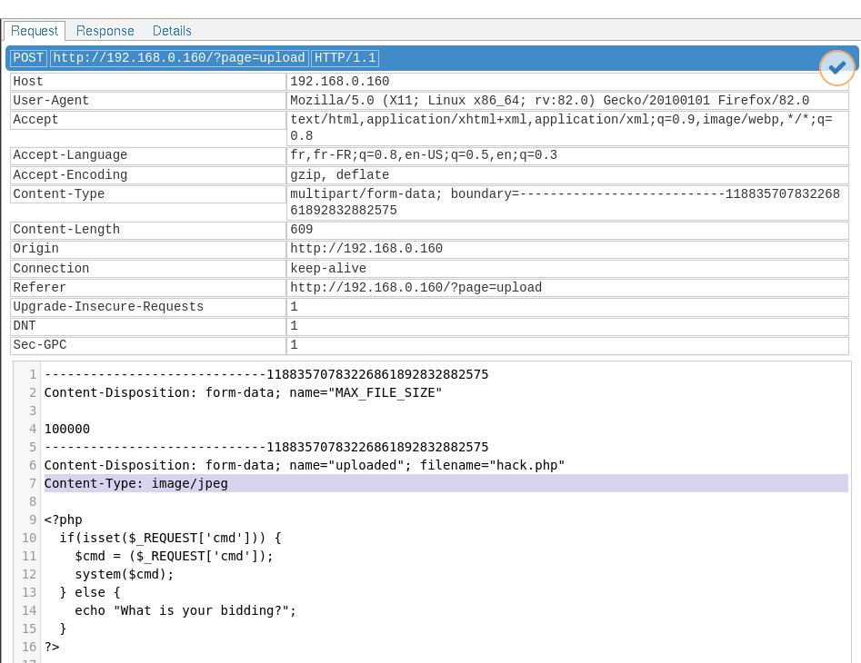

# Exploit

Let's see if we can inject some PHP code through the image upload functionality.  
If we try to upload a .php or .jpeg file, nothing happens.  
If we try to upload a .php.jpeg file, it uploads but the code is not executed.  
(I've read somewhere that this could have worked for apache server?)  
If we try local file inclusion by heading to `page?=../../../../../../tmp/myfile.php.jpeg` (and variations of this), nothing happens.

At this point, several other unsuccessful options were tested, such as encoding PHP directly in the image, as described [here]()

Then, using a proxy to look at the query, notice the combined Content-Type.  
If you have none running, check the [README] to run the docker container mitmproxy provided with this project.  
If you do this, you will have access to the mitmproxy GUI in your browser, at `0.0.0.0:8081`.

Attempt to load the hack.php file - the upload is unsuccessful.  
Head to mitmproxy and find the relevant query.

Notice the multi-part Content-Type header.  
If you edit the details, you can see that one of the Content-Type is `application/x-php`:

Change this to `image/jpeg` and save your changes.

Then replay the request and check the response's output content:

# Mitigating the risk

To understand more fully what's at stake with remote code excecution, especially when combined with privilege escalation, check the wiki on [arbitrary code execution](https://en.wikipedia.org/wiki/Arbitrary_code_execution).

Checking the Content-Type to prevent a script from being uploaded is not enough.  
According to [this post](https://www.wordfence.com/learn/how-to-prevent-file-upload-vulnerabilities/), additional precautions include:

- sanitizing the filename (to prevent extensions such as .php)
- checking the content of the file, for instance by calling a function that will fail if the image is invalid.

# Side note on knowing the server type 
Using the proxy, we know that server type is nginx.  
Or else if you make a bad request, the 404 page tells us so

If this proves to be a vulnerability, look into remediation

While exposed server information is not necessarily in itself a vulnerability, it is information that can assist attackers in exploiting other vulnerabilities that may exist.  
Exposed server information can also lead attackers to find version-specific server vulnerabilities that can be used to exploit unpatched servers.  
For this reason it is recommended that some precautions be taken:
    - Obscuring web server information in headers, such as with Apache’s mod_headers module.
    - Using a hardened reverse proxy server to create an additional layer of security between the web server and the Internet.
    - Ensuring that web servers are kept up-to-date with the latest software and security patches.