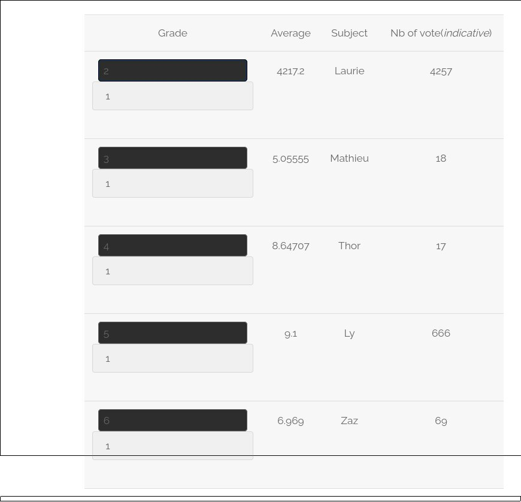
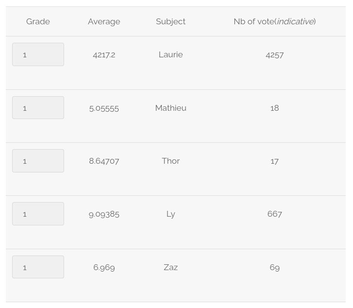
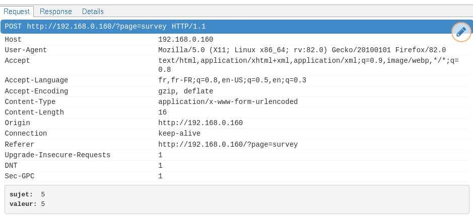
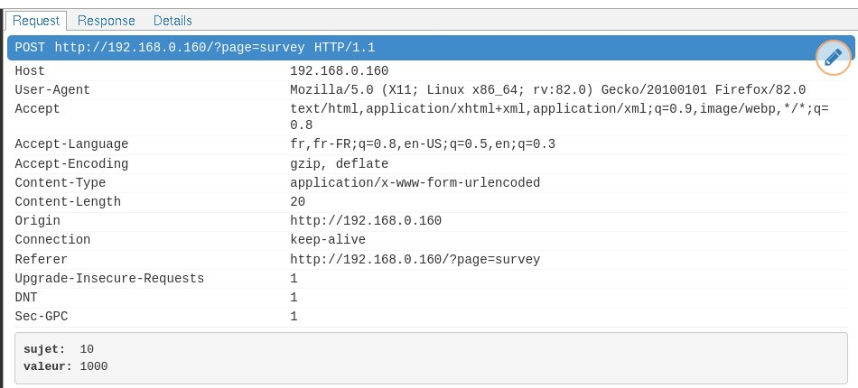
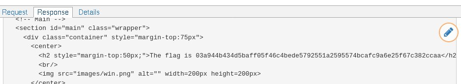

# Exploit

Notice the hidden input field above each user.  
Its name is "sujet" - this hints that the backend uses this value to know the id of the user whose score to change.

Let's check this by changing the first input from 1 to 5.
After submitting a score, we can see that subject #5 (Ly)'s nb of votes has gone up.

Let's check the request via a proxy (Refer to the general README to run Mitmproxy if necessary)

We see that there are two parameters, to communicate the subject and number of votes to the backend.
Let's change these values and replay the query:

Check the response for the flag:

# Mitigating the risk

We've seen that we can vote for a user not displayed on the screen and override the number of votes altogether.  
Aside from designing the code differently and avoiding hidden inputs, one should always control parameter values in the backend.
