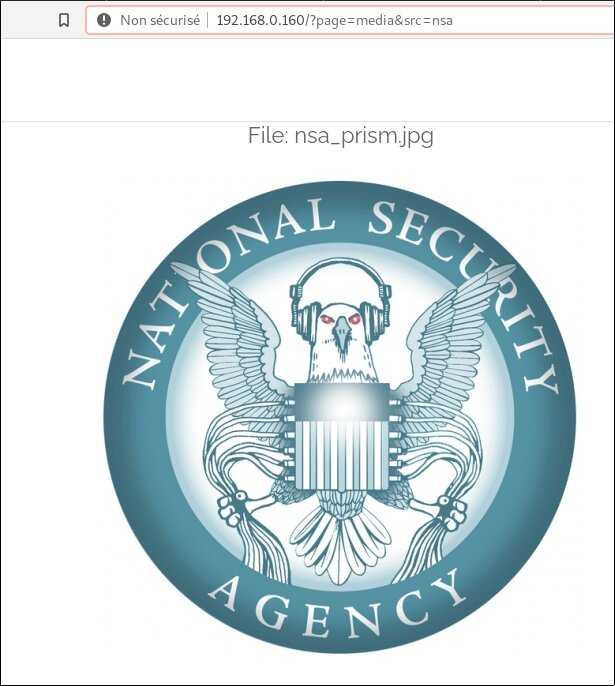
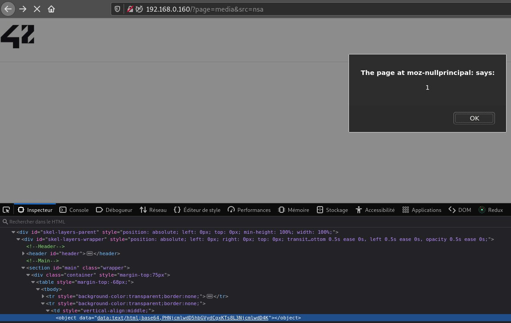
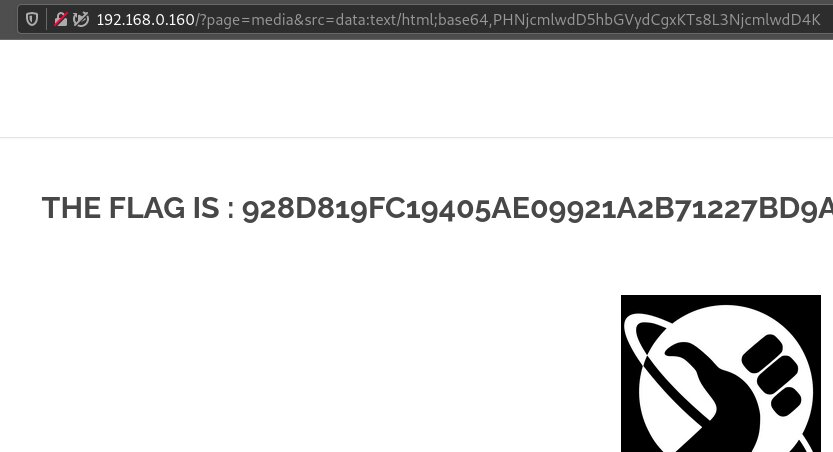

# Exploit

If we look carefully at the home page's code, we see that a link surrounds one image and leads to a ressource:



After trying several XSS possibilities with the src parameter as listed [here in the OWASP doc](https://owasp.org/www-community/xss-filter-evasion-cheatsheet), we can look for ways to bypass XSS filter.

As suggested in [this article](https://www.paladion.net/blogs/bypass-xss-filters-using-data-uris), we encode our evil script in base64:

```
[darkly@darkly] ~ # echo '<script>alert(1);</script>' | base64
PHNjcmlwdD5hbGVydCgxKTs8L3NjcmlwdD4K
```

Then, we try to inject this payload via a data-URI as the ressource object's source: 



It works!! Unfortunately, it seems this is not recognized by the project.

Let's try to use the same data-URI with the src parameter in the URL:



Actually, it also works without encoding, but does not capture the flag, with:

```
http://192.168.0.160/?page=media&src=data:text/html,%3Cscript%3Ealert(1)%3C/script%3E
```

# Mitigating the risk

Follow the [OWASP XSS Prevention cheat sheet](https://cheatsheetseries.owasp.org/cheatsheets/Cross_Site_Scripting_Prevention_Cheat_Sheet.html):
In this case, avoiding using a javascript url (that can execute Javascript code when use in URL DOM locations such as href attribute) would have been useful.:w
